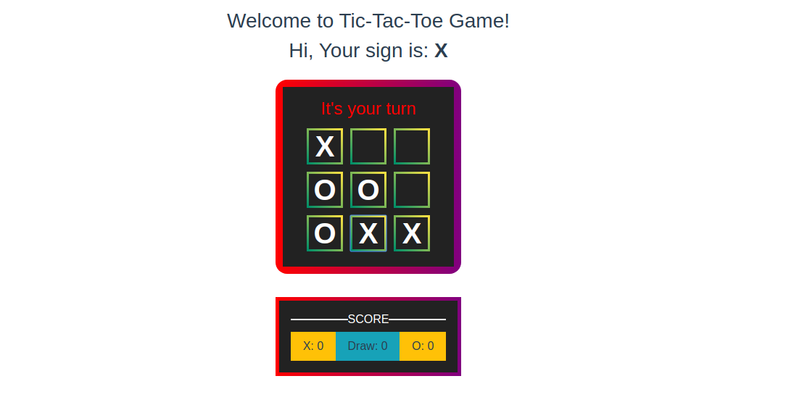

# v-tic-tac-toe game quick start
A simple tic-tac-toe multiplayer game built in Vue.js, Pusher and Node.js.
##

## Requirements
* [npm](https://www.npmjs.com/) node package manager
* Make sure port 8080 and 5000 are available in your machine

## Installation

Clone the repository

    git clone https://github.com/NazmusShakib/v-tic-tac-toe

Switch to the repository folder

    cd v-tic-tac-toe

Install all the dependencies

    npm install

> Head over to Pusher and [register for a free account](https://dashboard.pusher.com/accounts/sign_up), if you don’t already have one. Then create an app on [the dashboard](https://dashboard.pusher.com/) next, check the `Enable client events` from `App settings` tab. After that grab the credentials from `App keys` tab (app_id, key, secret and cluster). It is super straight-forward.

Copy the env.example file and make the required configuration changes in the .env file according to your app.

    cp .env.example .env

Build npm dependencies and run server

    npm run serve

You can now access the server at http://127.0.0.1:8080

**TL;DR command list**

    git clone https://github.com/NazmusShakib/v-tic-tac-toe
    cd v-tic-tac-toe
    npm install
    cp .env.example .env (**Set the pusher app credentials in .env**)

**Make sure you set the correct pusher app information before running**

    npm run serve

## Screenshot

